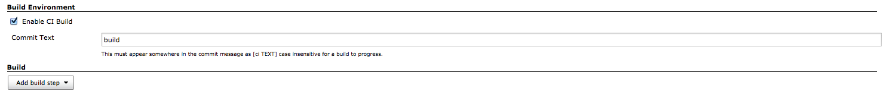

# Jenkins CI Build Plugin

This plugin allows builds to be made only for certain commit text in the commit message.

Full example:  (Assuming you set commit text to 'merge'.)

```
$ git commit -m 'finish feature [ci merge]'
```

This allows you when using a gitflow/hubflow to have Jenkins monitor feature branches but only build/merge
develop when a feature has been completed.  This skips the step of creating a pull request in the general
gitflow methodology.  You could also use [ci deploy] to cause a job which deploys to a staging server to run.

## Installation

Install the plugin from the Jenkins Plugin Manager.

### Enabling ci-skip

In the job configuration, check Enable CI Build and set the commit text to something.



### How it works

If an incoming changeset commit message does not include `[ci TEXT]`, the build is skipped as `NOT_BUILT`.
If there is no changeset, it will be built.

## Development

```
$ bundle install
$ ./bin/start-jenkins
$ open http://localhost:8083
```

### Run Test

```
$ bundle exec rake
```

### Build

```
$ jpi build
```

## Changelog

### Version 0.1 (September 29, 2014)

* initial release
